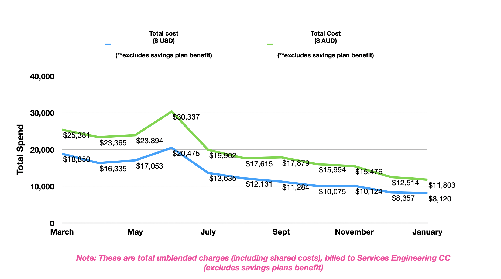

# Environment Provisioning - Cost Control Guidelines

## FinOps Tools
- AWS cost explorer (account specific)
- [Work Tracker](https://insideiaghome.iaglimited.net/Domino/IntranetApps/wms.nsf/all/ID:D94D3542FC63CFF6CA257CC3001E1E25?EditDocument)
- [CloudFoundations chargeback model](https://confluence.iag.com.au/pages/viewpage.action?pageId=847480824)
- [Cloud Foundations Monthly invoices](https://jira.iag.com.au/browse/CCC-1530)
- [Tableau Financial transactions dashboard](https://tableau.auiag.corp/#/site/Business_Intelligence/views/FinanceTransactionListing_15753528215580/TransactionListing)
- [CATS recovery team dashboard](https://tableau.auiag.corp/#/site/Business_Intelligence/views/GroupTechLabourDashboardFY22_16269269705640/TeamView?:iid=1)
- [IAG's AWS accounts & owner inventory](https://confluence.iag.com.au/display/CLOUD/Accounts+Linked+to+IAG+AWS+Master+Account)

## Cost Optimisation Techniques

- Define tagging strategy & implement automated tagging of each resource via CI/CD pipeline (ensure consistency across all environments)
- Identify & fix untagged resources e.g. VPC, subnets, snapshots, volumes, DB snapshots, ami’s
- Decommission manually created or untagged resources
- Identify inactive WRK’s via worktracker, reach out to owners to get alternate codes.
- Ensure your WRK’s and CC are not being used in other teams AWS accounts ( e.g. accounts inherited due to restructure)
- Identify and decommission long running unused environments
- Firstly understand how customers use our environments & identify under utilised resources i.e. low traffic due to closed projects e.g Unmapped VE’s were identified & decommissioned for EPD

## Improve Resource Utilisation
- Delete unused/detached EBS volumes, snapshots, unused EC2 (automated instance utilisation monitoring)
- Use Modern instance family based on AWS recommendations (AWS trusted advisor)
- EBS volumes - gp2 to gp3
- Instance right sizing based on CPU & memory utilisation 10% < or >80 %
- Cost Optimisation Initiative - FinOps
- CDE Environments List

## FinOps Capability Uplift :

- Dedicated FinOps squad to discover , track and implement cost optimisation opportunities  (weekly meetings)
- Process to feed Opportunities identified by FinOps squad into each sprint and actioned based on cost savings
- Train Devs on FinOps , and improve adoption of FinOps best practice
- Share nodes within same VE for development/testing purposes instead of reserving full VE environment per Dev
- Automated shutdown of dev VE’s after business hours
- Improve discipline amongst devs to release environments before planned leave
- Weekly FinOps meeting (Fridays) with IM to monitor and track costs related to development activities to identify & rectify any surges 
- Work with each VE owner to build awareness of their cost trends and work with them to optimise their VE nodes & schedules and provide them with monthly cost reports
- Work with multiple environment owners to encourage sharing of different nodes in same environment to reduce on mgmt costs of creating new VE with few nodes
- Separate FinOps initiative run to optimise/uplift FinOps for large programs like EPD

## Automation:

- Automated tagging , ensure all resources are tagged including logs , volumes, ami’s , networking services
- Automation to start/stop environments on schedule ( custom timings available to cater for different customer’s needs)
- Automated mechanism to update VE status, WRK and ownership on confluence so that customers can easily access info (without requiring access or knowledge on AWS )
- Service Now Form to make it easier for customers to request VE's
- Options available to spin up half VE, and create custom VE with apps of your choice (to avoid creating Full VE of 50+ nodes)
- Terms and Conditions to communicate terms of usage, shared responsibility model, VE rate card to help understand cost of VE's upfront, chargeback model before request
- Form to change VE schedules i.e. from 24*7 to business hours etc

## Reporting & Dashboards:
- FinOps Lead to create monthly AWS reporting based on
- Monthly Account level costs
- Monthly costs for our team/WRK/CC (Development costs) 
- Top 5 spending projects /VE owners trend
- Top AWS Service Usage trends
- Share the reportings/dashboards with
- Development Team to help them understand impact of DevOps practices on monthly costs
- Cloud FinOps Monthly AWS forum
- Past Presentations:
- Cloud FinOps Aug 22
- Cloud FinOps Nov 22
- EPD VE Rationalisation Jan23
- EPD VE&FE Rationalisation & Standards

## IAG Cloud FinOps Committee:
- Identified gap with CloudFoundations chargeback model , i.e. until FY23 CF were not sharing the Savings Plan benefit with other child AWS accounts
- Worked with Cloud SteerCo and Finance/Commercial teams to address this, and from FY24 new chargeback model will be implemented to share out the Savings Plan benefit
- Actively contributing Procurement , in finalising PPA for next 3 years (estimated upto additional 10% yearly savings)
- Assisting PCBC with their 3 year forecast to help with PPA
- Extending learnings from ADE platform FinOps work with other platforms, to help with savings for IAG's AWS spend
- Actively helping Slalom & Procurement to setup uniform Governance and tools across all our Cloud usage

# User Story

## Services Eng Techniques to improve Chargeback/Recovery:

- Introduced new chargeback model to charge customers for support & maintenance of long running VE’s (terms & conditions for usage clearly defined).
- Every Jira ticket for any VE support work tagged with correct WRK to ensure CATS recovery

